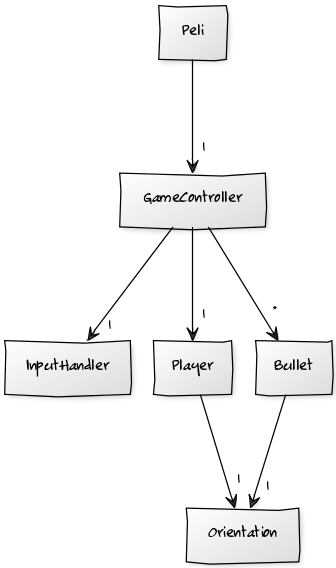
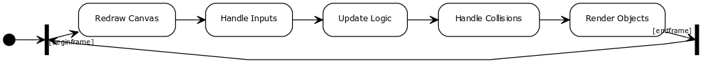
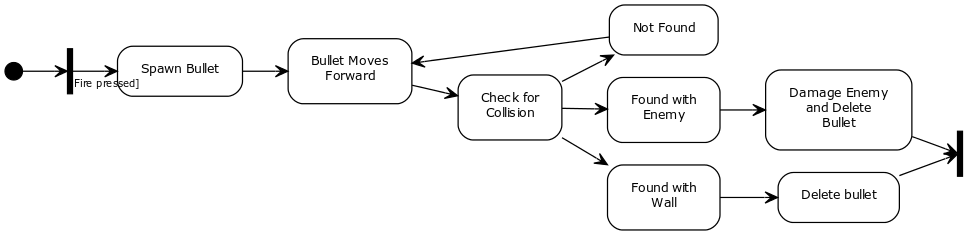
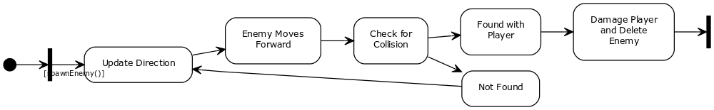

Aihe: Peli jossa liikutetaan pelaajaa ja ammutaan lähestyviä pahiksia kunnes kuollaan.

Käyttäjät: Pelaaja

Pelaajan toiminnot: 
Nuolinäppäimet liikuttaa pelaajaa näppäimen suuntaan.

Spacebar ampuu ammuksen, tai monta jos pitää näppäintä
pohjassa tarpeeksi kauan.

R resetoi pelin.

ESC sulkee pelin.

Luokka rakenne:

Pelin logiikan kulku sekvenssi:

Ammuksen elinikä:

Pahiksen elinikä:

